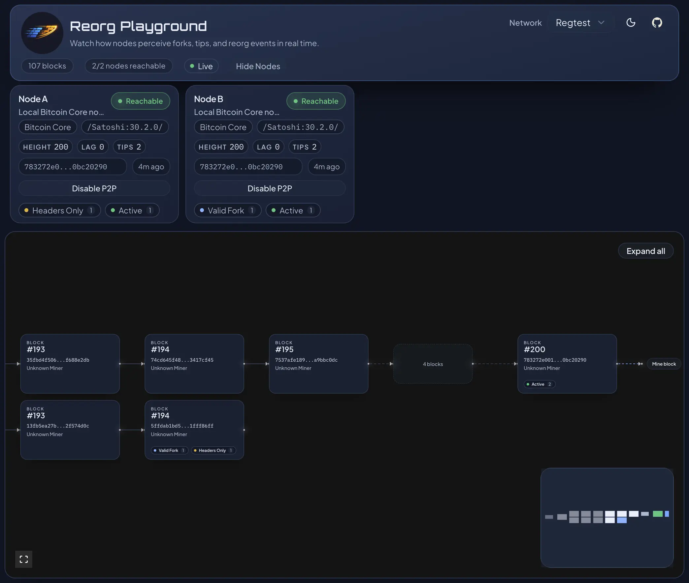

<a id="readme-top"></a>

# Reorg Playground

Reorg Playground is a Bitcoin tool for exploring forks, tip divergence, and reorg behavior across multiple node backends.

In normal network conditions, deeper reorg events are uncommon. That makes it easy for fork/reorg edge cases in wallets, explorers, and other Bitcoin-integrated systems to slip through pre-production testing.

With Reorg Playground, you can watch network state in near real time and deliberately produce blocks, isolate nodes, and create competing branches in development environments (Regtest and custom Signet).

https://github.com/user-attachments/assets/d5878016-3552-41db-83c7-b4acce98bbcd

## Getting Started

You can explore the hosted view-only deployment at [https://reorgplayground.app](https://reorgplayground.app). Use it for observing live network state (Mainnet + Testnet), you cannot run mining workflows.

### 1. App-Only Docker

Use this when you want to deploy just the app and point it at your own nodes.

1. Copy `config.toml.example` to `config.toml`, then adapt it for your nodes and RPC endpoints.
2. Start the app stack: `docker compose up -d --build`
3. Open the app: `http://localhost`
4. Stop it: `docker compose down`

This stack starts:

- `backend`
- `web`

### 2. Test Environment Docker

Use this when you want the bundled Regtest and custom Signet cluster for local experimentation.

1. Start the full test environment:

   ```bash
   docker compose -f docker-compose.test-env.yml up -d --build
   ```

2. Open the app: `http://localhost`
3. Stop it:

   ```bash
   docker compose -f docker-compose.test-env.yml down
   ```

4. Reset all test-env node volumes when needed:

   ```bash
   docker compose -f docker-compose.test-env.yml down -v
   ```

This stack starts:

- `backend`
- `web`
- 2 connected Bitcoin Core Regtest nodes (`bitcoind-regtest-a`, `bitcoind-regtest-b`)
- 3 Bitcoin Core custom Signet nodes: Miner A (`bitcoind-signet-a`), Miner B (`bitcoind-signet-b`), and Observer C (`bitcoind-signet-c`)

### 3. Host-Managed Regtest and Custom Signet

If you want to run the Bitcoin Core nodes directly on the host instead of through Docker, use the scripts in `scripts/` and adapt the variables at the top of each script for your local environment first.

For Regtest, start the 2-node setup with:

```bash
./scripts/start-regtest-nodes.sh
./scripts/stop-regtest-nodes.sh
```

This setup starts two connected Bitcoin Core Regtest nodes, `Node A` and `Node B`.

For custom Signet, start the 3-node setup using:

```bash
./scripts/start-signet-nodes.sh
./scripts/run-signet-miner.sh a 1 # mines 1 block on node A
./scripts/stop-signet-nodes.sh
```

This setup starts:

- `Miner A`
- `Miner B`
- `Observer C`

`Miner A` and `Miner B` share a fixed 1-of-2 Signet challenge, so either miner can produce blocks independently with the upstream `contrib/signet/miner` flow. `Observer C` does not have a signer descriptor and is intentionally non-mining.

Host-managed Signet mining defaults to `./bitcoin-core/contrib/signet/miner`. Override it with `BITCOIN_CORE_SIGNET_MINER=/path/to/contrib/signet/miner` when needed.

<p align="right">(<a href="#readme-top">back to top</a>)</p>

## Features

- Interactive block-header graph with forks, competing tips, and collapsible sections.
- Multi-backend node observation (Bitcoin Core, Electrum, Esplora, btcd) via RPC/REST.
- Observed stale-rate metric with configurable rolling windows and all-time view.
- `Trigger Reorg` button for Bitcoin Core on Regtest and custom Signet: pick the node and depth, then create a reorg in two clicks.
- `Node Connection Manager` for Bitcoin Core on Regtest and custom Signet: inspect inbound and outbound peer links, adapt node connectivity to create reorg scenarios, and disable/enable P2P networking. Set `view_only_mode` per network to disable these controls.
- Config-driven networks and nodes via `config.toml`.
- Header history persisted in SQLite.
- Responsive UI for forks, node health, and network state.

### Node Connection Manager

The `Node Connection Manager` lets you adapt inbound and outbound connections between your Bitcoin Core nodes while you experiment with reorg behavior. You can use it to isolate parts of the network, shape custom peer topologies, or simply disable and re-enable P2P networking without leaving the app.

<p align="center">
  
</p>

<p align="right">(<a href="#readme-top">back to top</a>)</p>

## Supported node backends

- Bitcoin Core
  - uses `getchaintips` RPC to fetch active and stale block tips
  - supports node interactions like mining a block or P2P isolation.
  - recommended as the primary node (use other backends mainly as comparative observers)
- Esplora
  - doesn't support stale tips (no `getchaintips`)
  - Blockstream.info and mempool.space are Esplora-based services
- Electrum
  - doesn't support stale tips (no `getchaintips`)
- btcd
  - uses `getchaintips` RPC to fetch active and stale block tips

<p align="right">(<a href="#readme-top">back to top</a>)</p>

## Known Limitations

- App-triggered mining and `Trigger Reorg` are currently supported only for Bitcoin Core on Regtest and custom Signet.
- P2P toggling works for Bitcoin Core on Regtest and custom Signet; controls can still be disabled per network via `view_only_mode`.
- Observed stale-rate metrics require a reachable backend with stale-tip visibility and enough retained history for the configured windows.
- Backend node data collection still relies on per-network polling (via config param `query_interval`), while frontend updates are pushed via SSE invalidation + snapshot refresh.

<p align="right">(<a href="#readme-top">back to top</a>)</p>

## Tech Stack

Backend:
   

Frontend:
    

<p align="right">(<a href="#readme-top">back to top</a>)</p>

## Top Contributors

<a href="https://github.com/noahjoeris/reorg-playground/graphs/contributors">
  
</a>

<p align="right">(<a href="#readme-top">back to top</a>)</p>

## Acknowledgement

This project is inspired by [fork-observer](https://github.com/0xb10c/fork-observer) by [0xB10C](https://github.com/0xb10c), but redesigned for interactive reorg experimentation.

<p align="right">(<a href="#readme-top">back to top</a>)</p>
